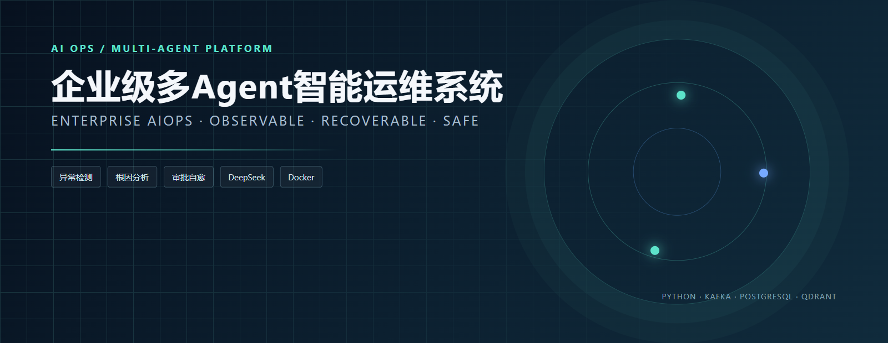
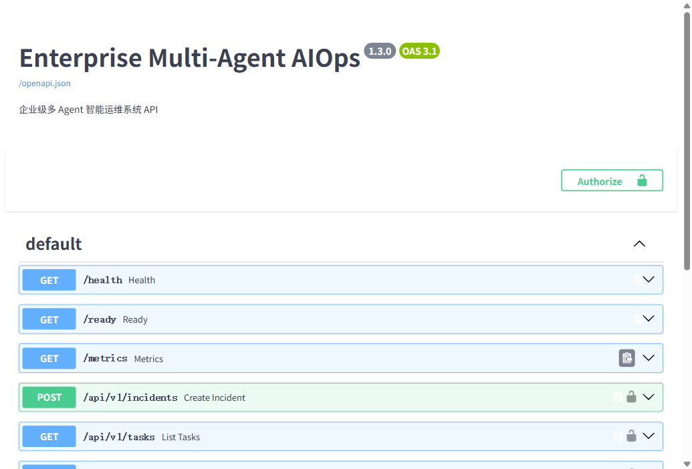
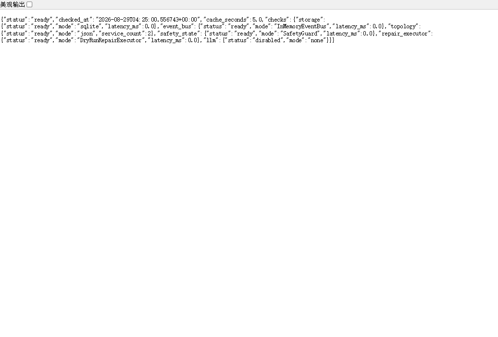
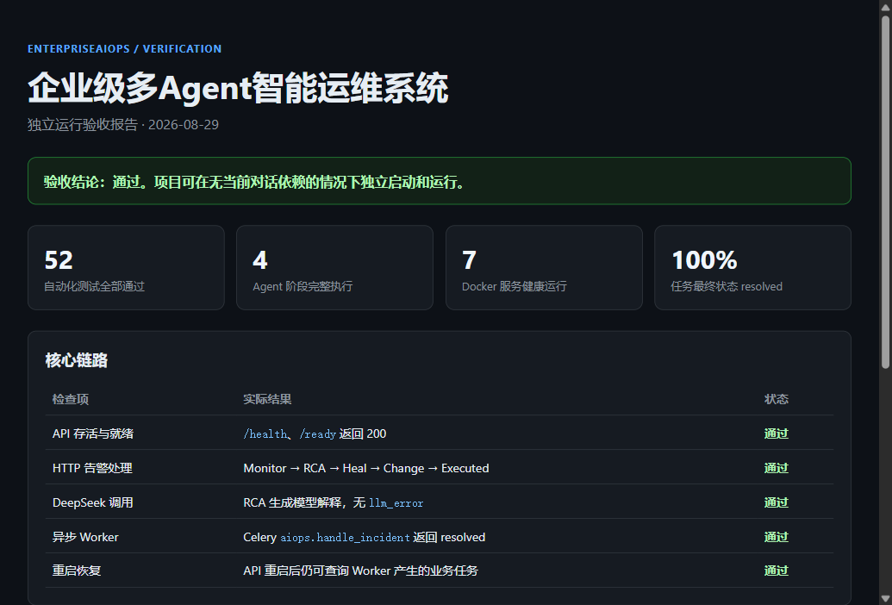
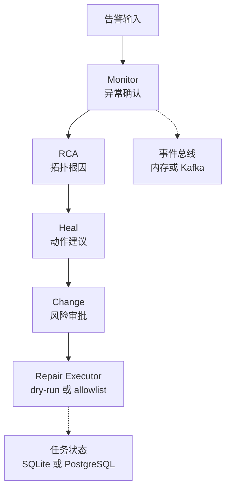

<div align="center">

# EnterpriseAIOps

### 面向企业后端的事件驱动智能运维服务

**告警接入 → 异常确认 → 根因分析 → 审批与安全修复**

[](02_Source/agent_tech_portfolio/requirements-fastapi.txt)
[](https://github.com/baiqijun233/EnterpriseAIOps/actions/workflows/ci.yml)
[](02_Source/agent_tech_portfolio/docker-compose.production.yml)
[](06_Tests)
[](LICENSE)

<p>
  <a href="#project-preview">项目预览</a> ·
  <a href="#features">核心能力</a> ·
  <a href="#architecture">运行架构</a> ·
  <a href="#quick-start">快速开始</a> ·
  <a href="#verification">测试验证</a> ·
  <a href="#roadmap">路线图</a>
</p>

</div>

EnterpriseAIOps 将监控告警、异常检测、拓扑分析、修复建议和变更审批串成可恢复的任务链路，适合云原生服务、内部平台和企业后端系统。默认使用离线数据和 dry-run 执行，先验证流程与安全边界，再接入真实基础设施。

> **当前版本 · v0.1.0**：52 项自动化测试通过；离线 API、审批恢复、异步 Worker、持久化与 Docker Compose 链路均已完成本机验证。默认修复策略为 dry-run，不会直接执行任意系统命令。

<a id="project-preview"></a>

## 🖼️ 项目预览



<table>
  <tr>
    <td width="50%"><strong>API 文档</strong><br></td>
    <td width="50%"><strong>就绪检查</strong><br></td>
  </tr>
  <tr>
    <td colspan="2"><strong>运行验收摘要</strong><br></td>
  </tr>
</table>

图片来自本地 API 和容器链路，展示接口、就绪探针和验收结果，不包含凭证或内部地址。

<a id="features"></a>

## ✨ 核心能力

| 模块 | 已实现能力 | 默认模式 |
| --- | --- | --- |
| Agent 编排 | Monitor、RCA、Heal、Change 四阶段任务链路 | 本地同步 |
| 异常检测 | 3-Sigma、EWMA、Isolation Forest 投票 | 标准库 |
| 根因分析 | 拓扑 BFS、置信度计算、可选检索/模型解释 | JSON 拓扑 |
| 状态与事件 | 检查点、幂等审批、内存总线或 Kafka | SQLite / 内存 |
| 安全治理 | 限流、熔断、爆炸半径、角色权限、审计 | dry-run |
| 异步与运维 | Celery、Redis、健康/就绪探针、Prometheus 指标 | 按需启用 |

### 关键设计取舍

- **先确认异常再进入修复**：检测阶段组合多种算法，避免单一阈值抖动直接触发后续动作。
- **自动化默认停在安全侧**：修复执行器默认 dry-run；高风险任务进入审批，allowlist 只接受明确参数而不是任意命令字符串。
- **任务可以从检查点恢复**：阶段状态、审批结果和幂等键被持久化，服务重启后可以查询并继续未完成任务。

<a id="architecture"></a>

## 🧩 运行架构



<a id="quick-start"></a>

## ⚡ 快速开始

环境要求：Python 3.11+；容器运行需要 Docker Desktop 或 Docker Engine。

```powershell
python -m unittest discover -s 06_Tests -p 'test_*.py'
& .\02_Source\agent_tech_portfolio\start_api.ps1
```

另开终端检查：

```powershell
Invoke-RestMethod http://127.0.0.1:8000/health
Invoke-RestMethod http://127.0.0.1:8000/ready
```

容器方式：

```powershell
docker compose -f .\02_Source\agent_tech_portfolio\docker-compose.production.yml up -d --build
Invoke-RestMethod http://127.0.0.1:18024/health
```

## 📦 已发布版本

- Release：[EnterpriseAIOps v0.1.0](https://github.com/baiqijun233/EnterpriseAIOps/releases/tag/v0.1.0)
- Container：`ghcr.io/baiqijun233/enterpriseaiops`

```powershell
docker pull ghcr.io/baiqijun233/enterpriseaiops:0.1.0
docker pull ghcr.io/baiqijun233/enterpriseaiops:latest
```

两个标签的公开镜像清单已验证可读取；生产环境建议固定使用版本标签。

## 🔌 常用接口

| 方法 | 路径 | 作用 |
| --- | --- | --- |
| GET | `/health` | 进程存活检查 |
| GET | `/ready` | 存储、事件总线和执行器就绪检查 |
| POST | `/api/v1/incidents` | 提交一条运维告警 |
| GET | `/api/v1/tasks` | 查询最近任务 |
| GET | `/api/v1/tasks/{task_id}` | 查询任务详情 |
| POST | `/api/v1/tasks/{task_id}/approval` | 恢复等待审批的任务 |
| GET | `/metrics` | Prometheus 文本指标 |

## 🔐 配置与安全边界

配置通过环境变量注入，常用项包括 `AIOPS_LLM`、`AIOPS_STORAGE`、`AIOPS_EVENT_BUS`、`AIOPS_TOPOLOGY`、`AIOPS_RAG` 和 `AIOPS_REPAIR_EXECUTOR`。外部模型、数据库、Kafka、Neo4j、Qdrant 和 Redis 的凭证不会写入仓库。

| 配置项 | 常用值 | 作用 |
| --- | --- | --- |
| `AIOPS_LLM` | `auto` / `deepseek` / `deterministic` / `none` | 选择根因解释策略 |
| `AIOPS_STORAGE` | `sqlite` / `postgres` | 选择任务状态存储 |
| `AIOPS_EVENT_BUS` | `memory` / `kafka` | 选择阶段事件总线 |
| `AIOPS_TOPOLOGY` | `json` / `neo4j` | 选择服务拓扑来源 |
| `AIOPS_RAG` | `none` / `json` / `http` / `qdrant` | 选择运维知识检索方式 |
| `AIOPS_REPAIR_EXECUTOR` | `dry-run` / `allowlist` | 控制修复执行策略 |

默认修复策略为 dry-run；allowlist 模式只接受显式参数列表，不执行任意 shell 字符串。模型不可用时会回退到离线分析，外部消息总线不可用时会记录错误并保留任务状态。

<a id="verification"></a>

## ✅ 测试与验证

```powershell
python -m unittest discover -s 06_Tests -p 'test_*.py'
python -m compileall -q 02_Source 06_Tests
docker compose -f .\02_Source\agent_tech_portfolio\docker-compose.production.yml config
& .\02_Source\agent_tech_portfolio\verify.ps1
```

| 检查项 | 当前结果 |
| --- | --- |
| 自动化测试 | 52 项通过，覆盖检测、RCA、审批、存储、异步 Worker 和安全护栏 |
| Python 编译 | `02_Source` 与 `06_Tests` 通过 |
| Compose 配置 | 生产编排文件解析通过 |
| 核心链路 | 健康/就绪探针、告警提交、任务查询与审批恢复已验证 |

这些结果说明当前代码和单机运行链路可重复验证，不代表未经压测的生产容量或服务等级。

## 📁 项目结构

```text
02_Source/agent_tech_portfolio/
├─ aiops_agent.py          任务编排与安全策略
├─ api_server.py           HTTP API 入口
├─ adapters/               Redis、Neo4j、队列等适配器
├─ common/                 存储和公共组件
├─ start_*.ps1             API/Worker 启动脚本
├─ Dockerfile              容器构建文件
└─ docker-compose*.yml     本地与扩展拓扑模板
```

## 🧱 实现范围与第三方组件

维护者主导流程设计、Agent 编排、故障安全策略、接口、测试和部署配置。Celery、Redis、Kafka、PostgreSQL、Neo4j、Qdrant 及兼容模型服务通过适配层接入，便于按目标环境替换。

<a id="roadmap"></a>

## 🗺️ 当前边界与路线图

当前版本可在离线模式和单机容器中验证完整流程。正式部署还需要企业数据库与消息集群、TLS/反向代理、集中式密钥管理、监控告警、变更平台回滚接口和压测数据；后续将完善全链路观测、CMDB 接口和灰度发布策略。

## 🤝 贡献、许可证与安全

欢迎通过 Issue 或 Pull Request 参与。提交前请运行测试并移除运行数据、密钥和本机路径。本项目使用 [MIT License](LICENSE)，安全问题请按 [SECURITY.md](SECURITY.md) 联系维护者。
