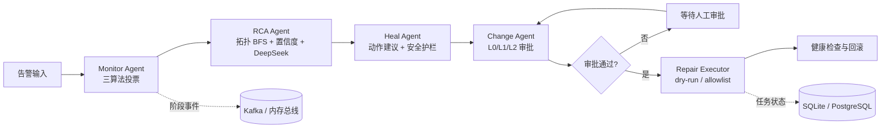

# EnterpriseAIOps

## 企业级多Agent智能运维系统

一个面向云原生和企业后端场景的多 Agent 智能运维项目。系统将异常检测、拓扑根因分析、故障自愈建议和变更审批串成可恢复的事件驱动流程，并通过安全护栏、审计记录和可替换基础设施适配层控制自动化风险。

> 项目定位：AI 应用开发、Agent 工程和 Python 后端开发岗位的可运行技术项目。

## 项目亮点

- **多 Agent 协作**：监控 Agent、RCA 根因分析 Agent、自愈 Agent、审批 Agent 分工处理运维事件。
- **可解释异常检测**：3-Sigma、EWMA、Isolation Forest 三种算法投票确认异常，降低单一规则误报。
- **可恢复编排**：阶段级重试、SQLite 检查点、审批等待与恢复，API 重启后仍可查询任务。
- **安全自动化**：dry-run 默认保护、限流、爆炸半径阈值、熔断、L0/L1/L2 审批和执行后健康检查。
- **DeepSeek 优先**：配置 `AIOPS_DEEPSEEK_API_KEY` 后自动使用 DeepSeek；没有密钥时自动回退到离线模式。
- **生产适配边界**：已提供 PostgreSQL、Kafka、Redis/Celery、Neo4j、Qdrant、CMDB、Loki、Jaeger 等适配层。
- **可独立运行**：默认只需 Python 标准库；也可以用 Docker Compose 启动 API、Worker 和基础设施服务。

## 架构



## 能力清单

| 模块 | 已实现能力 | 默认模式 |
| --- | --- | --- |
| Agent 编排 | 监控、RCA、自愈、审批四阶段 | 本地同步 |
| 异常检测 | 3-Sigma、EWMA、Isolation Forest 投票 | 标准库 |
| 根因分析 | 拓扑 BFS、贝叶斯置信度、RAG/LLM 解释 | JSON 拓扑 |
| 状态持久化 | 任务查询、检查点、幂等审批 | SQLite |
| 事件总线 | 阶段主题、手动确认、DLQ | 内存事件总线 |
| 安全治理 | 限流、熔断、爆炸半径、角色权限、审计 | dry-run |
| 异步任务 | Celery Worker、Redis Broker、Worker 就绪检查 | 按需启用 |
| 外部适配 | PostgreSQL、Kafka、Neo4j、Qdrant、CMDB、Loki、Jaeger | 按需启用 |

## 快速开始

### 方式一：离线运行

环境要求：Windows PowerShell 7 或 Linux/macOS，Python 3.11+。

```powershell
Set-Location E:\Agent\AIProjects\Project024_EnterpriseAIOps
python -m unittest discover -s 06_Tests -p 'test_*.py'
& .\02_Source\agent_tech_portfolio\start_api.ps1
```

另开终端发送测试告警：

```powershell
$body = '{"service":"order-service","metric":"cpu","value":95,"baseline":[40,41,39,42,40]}'
Invoke-RestMethod -Method Post -Uri http://127.0.0.1:8000/api/v1/incidents `
  -ContentType 'application/json' -Body $body
```

### 方式二：Docker Compose

```powershell
Set-Location E:\Agent\AIProjects\Project024_EnterpriseAIOps
docker compose -f .\02_Source\agent_tech_portfolio\docker-compose.production.yml up -d --build
Invoke-RestMethod http://127.0.0.1:18024/health
Invoke-RestMethod http://127.0.0.1:18024/ready
```

默认映射端口：API `18024`、Redis `6380`、PostgreSQL `15433`、Kafka `29092`、Qdrant `16333`。端口可通过 Compose 环境变量调整。

停止本项目容器但保留数据卷：

```powershell
docker compose -f .\02_Source\agent_tech_portfolio\docker-compose.production.yml down
```

### 启用 DeepSeek

密钥只通过环境变量注入，不要写入仓库或 Compose 文件：

```powershell
$env:AIOPS_LLM = 'deepseek'
$env:AIOPS_DEEPSEEK_API_KEY = '你的 DeepSeek API Key'
$env:AIOPS_DEEPSEEK_MODEL = 'deepseek-chat'
& .\02_Source\agent_tech_portfolio\start_api.ps1
```

也可以保持 `AIOPS_LLM=auto`。检测到 `AIOPS_DEEPSEEK_API_KEY` 时会自动优先使用 DeepSeek，没有密钥则离线运行。

## API 入口

| 方法 | 路径 | 作用 |
| --- | --- | --- |
| GET | `/health` | 进程存活检查 |
| GET | `/ready` | 存储、事件总线、拓扑和执行器就绪检查 |
| GET | `/metrics` | Prometheus 文本指标 |
| POST | `/api/v1/incidents` | 提交一条运维告警 |
| GET | `/api/v1/tasks` | 查询最近任务 |
| GET | `/api/v1/tasks/{task_id}` | 查询任务详情 |
| POST | `/api/v1/tasks/{task_id}/approval` | 恢复等待审批的任务 |

标准库 HTTP API 默认监听 `8000`，Docker Compose 中 FastAPI API 默认映射到宿主机 `18024`。

## 配置切换

复制 `02_Source/agent_tech_portfolio/.env.example` 作为变量参考，然后在运行环境中设置变量。程序不会自动读取 `.env` 文件。

| 变量 | 可选值 | 说明 |
| --- | --- | --- |
| `AIOPS_LLM` | `auto` / `deepseek` / `deterministic` / `none` | 模型策略，默认自动选择 |
| `AIOPS_STORAGE` | `sqlite` / `postgres` | 任务存储 |
| `AIOPS_EVENT_BUS` | `memory` / `kafka` | 事件总线 |
| `AIOPS_TOPOLOGY` | `json` / `neo4j` | 服务拓扑来源 |
| `AIOPS_RAG` | `none` / `json` / `http` / `qdrant` | 运维知识检索 |
| `AIOPS_REPAIR_EXECUTOR` | `dry-run` / `allowlist` | 修复执行策略，默认安全模式 |
| `AIOPS_AUTH_ENABLED` | `true` / `false` | 是否启用 API Key 认证 |

## 安全边界

- 默认是 dry-run，不会直接执行系统命令。
- allowlist 模式只接受显式参数列表，使用 `shell=False`，不接受任意 shell 字符串。
- 自动修复受限流、爆炸半径和熔断器保护；高风险任务进入人工审批。
- API Key 仅从环境变量读取，日志和审计不会保存原始密钥。
- DeepSeek、数据库和其他生产凭证不包含在仓库中。

## 测试与验证

```powershell
python -m unittest discover -s 06_Tests -p 'test_*.py'
python -m compileall -q 02_Source 06_Tests
& .\02_Source\agent_tech_portfolio\verify.ps1
```

当前版本已完成 52 项自动化测试，并验证了以下链路：

- 默认离线 API 与 Worker 独立运行。
- DeepSeek 真实 RCA 调用与无密钥离线回退。
- PostgreSQL 任务写入、Kafka 四主题、Qdrant 健康检查。
- API 重启后任务查询和 Celery 异步任务完成。
- Docker API/Worker 镜像构建和 Compose 配置校验。

## 项目目录

```text
00_Project_Workbench/  项目进度、维护说明和长期决策
01_Requirements/       需求与验收范围
02_Source/             源码、启动脚本和 Compose
03_Assets/             项目素材
04_Data/               拓扑、CMDB、Runbook 等样例数据
05_Docs/               运行手册与正式上线升级计划
06_Tests/              自动化测试与本地基准脚本
07_Logs/               验证记录和版本备份
08_Deliverables/       交付物
```

## 正式上线说明

本项目已经具备“替换环境适配参数即可接入”的工程结构。正式上线仍需配置企业级数据库、Kafka 集群、密钥管理、TLS、容器平台、监控告警、变更平台 API、压测、备份恢复和灰度发布。详细清单见 [`05_Docs/正式上线升级计划.md`](05_Docs/正式上线升级计划.md)。

## 许可证

本项目当前用于学习、求职展示和技术验证。生产使用前请根据组织要求补充许可证、依赖合规和安全审计。
